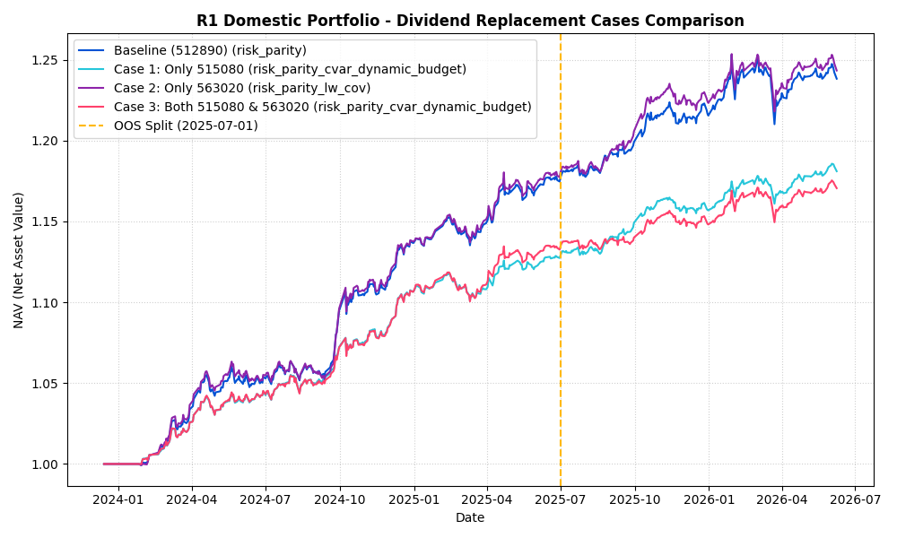

# 用户持仓 (515080 & 563020) 替代回测与均衡调仓分析报告
报告生成时间: 2026-06-08 23:50:07

## 1. 概述与持仓本金说明
本报告针对用户目前在其他软件中持有的红利资产：
*   **招商中证红利 ETF (515080.SH)**: 50,000 股 | `2026-06-08` 收盘价: `1.584 元` | 现有市值: `79,200.00 元`
*   **易方达红利低波 ETF (563020.SH)**: 130,800 股 | `2026-06-08` 收盘价: `1.168 元` | 现有市值: `152,774.40 元`
*   **当前持仓总市值 (重估本金)**: **231,974.40 元**

根据用户要求，我们**仅使用现有的 515080 或 563020 或者同时使用两者（共有 3 种情况）替代原资产配置中的红利资产（代码 512890），而不替换别的资产**（如沪深300、标普500、纳指、黄金、国债等）。
我们在 `2023-12-14` 至 `2026-06-08` 区间对全部 6 大类 baseline 投资组合及 6 种核心策略（共计 144 种配置）进行了严格的交叉回测与起点敏感性测试。
样本划分规约如下：
*   **研究训练样本 (IS)**：`2023-12-14` 至 `2025-06-30`，策略评估与优选仅在此区间进行。
*   **最终测试样本 (OOS)**：`2025-07-01` 至 `2026-06-08`，用作样本外效果的最终验收。

## 2. 6 大类组合 VS 3 种红利替代情况回测结果汇总

### 2.x R1 国内组合 (交叉回测指标表)

| 替换方案 | 策略名称 | IS 夏普 (训练) | OOS 夏普 (测试) | IS 最大回撤 | OOS 最大回撤 | 敏感性标准差 (IS) | 交易笔数 (IS) |
| :--- | :--- | :---: | :---: | :---: | :---: | :---: | :---: |
| 原基线 (512890) | risk_parity | 3.2110 | 1.4092 | -1.51% | -3.43% | 0.2361 | 11 |
| 原基线 (512890) | risk_parity_lw_cov | 3.1910 | 1.6808 | -1.48% | -2.70% | 0.2581 | 15 |
| 原基线 (512890) | risk_parity_ewma | 3.1681 | 1.3425 | -1.78% | -3.65% | 0.2444 | 19 |
| 原基线 (512890) | risk_parity_cvar_dynamic_budget | 3.1127 | 2.2998 | -1.51% | -1.34% | 0.2016 | 10 |
| 原基线 (512890) | hrp | 3.0748 | 1.7568 | -1.72% | -0.74% | 0.2681 | 7 |
| 原基线 (512890) | risk_parity_ewma_dd_recovery | 3.0666 | 1.3056 | -1.66% | -4.24% | 0.2724 | 22 |
| Case 3: 两者共同 | risk_parity_cvar_dynamic_budget | 3.1067 | 1.4514 | -1.61% | -1.84% | 0.2947 | 14 |
| Case 3: 两者共同 | hrp | 3.0484 | 1.7002 | -1.72% | -0.76% | 0.2726 | 11 |
| Case 3: 两者共同 | risk_parity | 2.9351 | 1.2703 | -1.45% | -3.18% | 0.2369 | 16 |
| Case 3: 两者共同 | risk_parity_lw_cov | 2.8283 | 1.5250 | -1.51% | -2.61% | 0.2488 | 14 |
| Case 3: 两者共同 | risk_parity_ewma | 2.6248 | 1.1020 | -2.43% | -4.14% | 0.2895 | 23 |
| Case 3: 两者共同 | risk_parity_ewma_dd_recovery | 2.5234 | 1.0905 | -2.57% | -4.25% | 0.1943 | 22 |
| Case 1: 仅515080 | risk_parity_cvar_dynamic_budget | 3.1510 | 2.3416 | -1.49% | -1.47% | 0.2530 | 7 |
| Case 1: 仅515080 | risk_parity | 3.0744 | 1.7951 | -1.45% | -2.62% | 0.2475 | 13 |
| Case 1: 仅515080 | hrp | 3.0452 | 1.5570 | -1.72% | -1.16% | 0.2842 | 7 |
| Case 1: 仅515080 | risk_parity_lw_cov | 3.0003 | 1.8147 | -1.43% | -2.83% | 0.2546 | 11 |
| Case 1: 仅515080 | risk_parity_ewma | 2.9345 | 1.4253 | -1.90% | -3.84% | 0.2998 | 18 |
| Case 1: 仅515080 | risk_parity_ewma_dd_recovery | 2.8597 | 1.4383 | -1.77% | -3.67% | 0.2962 | 19 |
| Case 2: 仅563020 | risk_parity_lw_cov | 3.1564 | 1.5881 | -1.48% | -2.84% | 0.2585 | 15 |
| Case 2: 仅563020 | risk_parity | 3.1531 | 1.3195 | -1.49% | -3.49% | 0.2288 | 12 |
| Case 2: 仅563020 | risk_parity_ewma | 3.1468 | 1.2626 | -1.64% | -4.23% | 0.2583 | 19 |
| Case 2: 仅563020 | risk_parity_ewma_dd_recovery | 3.1166 | 1.2097 | -1.66% | -4.35% | 0.2958 | 18 |
| Case 2: 仅563020 | risk_parity_cvar_dynamic_budget | 3.0931 | 2.2244 | -1.52% | -1.39% | 0.1886 | 8 |
| Case 2: 仅563020 | hrp | 3.0816 | 1.6807 | -1.72% | -0.74% | 0.3127 | 8 |

### 2.x R1 国内低波防守组合 (交叉回测指标表)

| 替换方案 | 策略名称 | IS 夏普 (训练) | OOS 夏普 (测试) | IS 最大回撤 | OOS 最大回撤 | 敏感性标准差 (IS) | 交易笔数 (IS) |
| :--- | :--- | :---: | :---: | :---: | :---: | :---: | :---: |
| 原基线 (512890) | risk_parity_ewma | 3.2761 | 0.9085 | -1.70% | -3.78% | 0.1534 | 18 |
| 原基线 (512890) | risk_parity_cvar_dynamic_budget | 3.1556 | 1.1414 | -1.65% | -1.07% | 0.2220 | 6 |
| 原基线 (512890) | risk_parity_ewma_dd_recovery | 3.1451 | 0.9446 | -1.81% | -2.93% | 0.1680 | 18 |
| 原基线 (512890) | risk_parity_lw_cov | 3.1343 | 1.3422 | -1.65% | -2.56% | 0.2161 | 10 |
| 原基线 (512890) | risk_parity | 3.0571 | 1.0538 | -1.66% | -2.41% | 0.1617 | 9 |
| 原基线 (512890) | hrp | 2.8318 | 1.3156 | -1.84% | -0.97% | 0.4068 | 6 |
| Case 3: 两者共同 | risk_parity_cvar_dynamic_budget | 3.0137 | 1.4568 | -1.62% | -1.34% | 0.2785 | 8 |
| Case 3: 两者共同 | hrp | 2.8784 | 1.3671 | -1.77% | -0.93% | 0.3983 | 7 |
| Case 3: 两者共同 | risk_parity | 2.7784 | 0.8698 | -1.64% | -3.41% | 0.2908 | 12 |
| Case 3: 两者共同 | risk_parity_lw_cov | 2.7470 | 0.8310 | -1.66% | -3.69% | 0.2710 | 12 |
| Case 3: 两者共同 | risk_parity_ewma | 2.7400 | 0.7533 | -1.81% | -4.04% | 0.2080 | 20 |
| Case 3: 两者共同 | risk_parity_ewma_dd_recovery | 2.5741 | 0.7128 | -1.83% | -4.14% | 0.2146 | 23 |
| Case 1: 仅515080 | risk_parity_ewma | 3.0564 | 1.0580 | -1.82% | -4.03% | 0.1785 | 19 |
| Case 1: 仅515080 | risk_parity_cvar_dynamic_budget | 3.0271 | 1.7431 | -1.63% | -1.32% | 0.2164 | 6 |
| Case 1: 仅515080 | risk_parity_ewma_dd_recovery | 2.9605 | 1.2463 | -1.95% | -2.97% | 0.1894 | 19 |
| Case 1: 仅515080 | risk_parity_lw_cov | 2.8941 | 1.5370 | -1.63% | -2.76% | 0.2423 | 11 |
| Case 1: 仅515080 | risk_parity | 2.8719 | 1.2807 | -1.65% | -2.68% | 0.2282 | 9 |
| Case 1: 仅515080 | hrp | 2.7983 | 1.3776 | -1.83% | -0.93% | 0.3830 | 6 |
| Case 2: 仅563020 | risk_parity_ewma | 3.2360 | 0.8188 | -1.69% | -3.89% | 0.1998 | 14 |
| Case 2: 仅563020 | risk_parity_cvar_dynamic_budget | 3.1294 | 1.1762 | -1.64% | -1.15% | 0.2435 | 5 |
| Case 2: 仅563020 | risk_parity_ewma_dd_recovery | 3.0798 | 0.8210 | -1.79% | -3.04% | 0.2085 | 20 |
| Case 2: 仅563020 | risk_parity_lw_cov | 3.0724 | 1.2525 | -1.64% | -2.73% | 0.2273 | 9 |
| Case 2: 仅563020 | risk_parity | 3.0050 | 0.8751 | -1.64% | -2.60% | 0.1964 | 8 |
| Case 2: 仅563020 | hrp | 2.8262 | 1.2682 | -1.84% | -0.97% | 0.4248 | 5 |

### 2.x R2 全球红利组合 (交叉回测指标表)

| 替换方案 | 策略名称 | IS 夏普 (训练) | OOS 夏普 (测试) | IS 最大回撤 | OOS 最大回撤 | 敏感性标准差 (IS) | 交易笔数 (IS) |
| :--- | :--- | :---: | :---: | :---: | :---: | :---: | :---: |
| 原基线 (512890) | risk_parity_cvar_dynamic_budget | 3.2618 | 1.4635 | -2.11% | -1.41% | 0.2592 | 11 |
| 原基线 (512890) | risk_parity_ewma | 3.0732 | 1.3658 | -2.69% | -3.13% | 0.1640 | 23 |
| 原基线 (512890) | risk_parity_ewma_dd_recovery | 3.0084 | 1.2785 | -2.58% | -3.09% | 0.1961 | 22 |
| 原基线 (512890) | hrp | 2.9781 | 1.4607 | -2.05% | -0.96% | 0.4450 | 10 |
| 原基线 (512890) | risk_parity_lw_cov | 2.9259 | 1.4480 | -2.53% | -3.12% | 0.2174 | 12 |
| 原基线 (512890) | risk_parity | 2.7971 | 1.4078 | -2.49% | -3.03% | 0.2145 | 17 |
| Case 3: 两者共同 | risk_parity_cvar_dynamic_budget | 3.1254 | 1.2371 | -1.98% | -1.62% | 0.3055 | 16 |
| Case 3: 两者共同 | hrp | 2.9039 | 1.3410 | -2.14% | -1.13% | 0.4377 | 8 |
| Case 3: 两者共同 | risk_parity | 2.5680 | 1.1740 | -2.54% | -3.27% | 0.2209 | 21 |
| Case 3: 两者共同 | risk_parity_lw_cov | 2.5516 | 1.1287 | -2.52% | -3.32% | 0.2437 | 20 |
| Case 3: 两者共同 | risk_parity_ewma_dd_recovery | 2.5466 | 0.8292 | -2.33% | -4.70% | 0.2097 | 22 |
| Case 3: 两者共同 | risk_parity_ewma | 2.4550 | 0.9048 | -2.65% | -4.59% | 0.1231 | 16 |
| Case 1: 仅515080 | risk_parity_cvar_dynamic_budget | 3.1415 | 1.6390 | -2.06% | -1.63% | 0.3121 | 14 |
| Case 1: 仅515080 | hrp | 2.9359 | 1.4807 | -2.04% | -1.48% | 0.4560 | 10 |
| Case 1: 仅515080 | risk_parity_ewma | 2.8788 | 1.4752 | -2.64% | -3.56% | 0.1804 | 23 |
| Case 1: 仅515080 | risk_parity_ewma_dd_recovery | 2.8276 | 1.4542 | -2.55% | -3.48% | 0.1998 | 21 |
| Case 1: 仅515080 | risk_parity_lw_cov | 2.7518 | 1.7224 | -2.43% | -3.41% | 0.2463 | 13 |
| Case 1: 仅515080 | risk_parity | 2.6037 | 1.5537 | -2.62% | -3.08% | 0.2680 | 16 |
| Case 2: 仅563020 | risk_parity_cvar_dynamic_budget | 3.1283 | 1.3636 | -2.12% | -1.49% | 0.3064 | 11 |
| Case 2: 仅563020 | risk_parity_ewma | 3.0474 | 1.2372 | -2.67% | -3.30% | 0.1909 | 20 |
| Case 2: 仅563020 | risk_parity_ewma_dd_recovery | 2.9704 | 1.1536 | -2.56% | -3.22% | 0.2406 | 20 |
| Case 2: 仅563020 | hrp | 2.9642 | 1.3745 | -2.07% | -1.48% | 0.4751 | 10 |
| Case 2: 仅563020 | risk_parity_lw_cov | 2.8795 | 1.5514 | -2.50% | -3.25% | 0.2485 | 12 |
| Case 2: 仅563020 | risk_parity | 2.7478 | 1.2324 | -2.46% | -3.33% | 0.2185 | 16 |

### 2.x R2 全球标准组合 (交叉回测指标表)

| 替换方案 | 策略名称 | IS 夏普 (训练) | OOS 夏普 (测试) | IS 最大回撤 | OOS 最大回撤 | 敏感性标准差 (IS) | 交易笔数 (IS) |
| :--- | :--- | :---: | :---: | :---: | :---: | :---: | :---: |
| 原基线 (512890) | risk_parity_cvar_dynamic_budget | 3.3185 | 1.7606 | -1.93% | -1.60% | 0.2957 | 15 |
| 原基线 (512890) | risk_parity_ewma_dd_recovery | 3.1129 | 1.3531 | -2.38% | -5.01% | 0.2846 | 25 |
| 原基线 (512890) | hrp | 3.1055 | 1.5240 | -1.96% | -1.37% | 0.2593 | 16 |
| 原基线 (512890) | risk_parity_ewma | 3.0784 | 1.4081 | -2.66% | -4.89% | 0.2878 | 22 |
| 原基线 (512890) | risk_parity | 2.9853 | 1.7029 | -2.64% | -3.07% | 0.2199 | 22 |
| 原基线 (512890) | risk_parity_lw_cov | 2.9603 | 1.7734 | -2.61% | -3.40% | 0.2396 | 21 |
| Case 3: 两者共同 | risk_parity_cvar_dynamic_budget | 3.2453 | 1.4813 | -1.89% | -1.95% | 0.3488 | 18 |
| Case 3: 两者共同 | hrp | 3.1226 | 1.5165 | -1.97% | -1.20% | 0.3248 | 12 |
| Case 3: 两者共同 | risk_parity | 2.7779 | 1.4298 | -2.66% | -3.15% | 0.2289 | 24 |
| Case 3: 两者共同 | risk_parity_lw_cov | 2.7096 | 1.5104 | -2.69% | -3.27% | 0.2492 | 24 |
| Case 3: 两者共同 | risk_parity_ewma | 2.5988 | 1.1949 | -2.93% | -4.75% | 0.2597 | 26 |
| Case 3: 两者共同 | risk_parity_ewma_dd_recovery | 2.2008 | 1.1613 | -3.09% | -4.89% | 0.1853 | 19 |
| Case 1: 仅515080 | risk_parity_cvar_dynamic_budget | 3.3169 | 2.2022 | -1.91% | -1.70% | 0.3558 | 13 |
| Case 1: 仅515080 | hrp | 3.0819 | 1.5456 | -2.04% | -1.16% | 0.2994 | 7 |
| Case 1: 仅515080 | risk_parity_ewma_dd_recovery | 2.9268 | 1.6993 | -2.33% | -3.73% | 0.3096 | 25 |
| Case 1: 仅515080 | risk_parity | 2.8873 | 1.7452 | -2.72% | -3.20% | 0.2348 | 21 |
| Case 1: 仅515080 | risk_parity_ewma | 2.8576 | 1.5836 | -2.90% | -4.29% | 0.2748 | 23 |
| Case 1: 仅515080 | risk_parity_lw_cov | 2.8219 | 1.8628 | -2.73% | -3.46% | 0.2514 | 21 |
| Case 2: 仅563020 | risk_parity_cvar_dynamic_budget | 3.2961 | 2.0457 | -1.93% | -1.65% | 0.2924 | 14 |
| Case 2: 仅563020 | hrp | 3.1242 | 1.4470 | -2.02% | -1.15% | 0.2753 | 9 |
| Case 2: 仅563020 | risk_parity_ewma | 3.0607 | 1.3143 | -2.57% | -4.98% | 0.2549 | 22 |
| Case 2: 仅563020 | risk_parity_ewma_dd_recovery | 3.0601 | 1.5262 | -2.36% | -3.63% | 0.2803 | 21 |
| Case 2: 仅563020 | risk_parity | 2.9642 | 1.5377 | -2.60% | -3.32% | 0.2074 | 21 |
| Case 2: 仅563020 | risk_parity_lw_cov | 2.9328 | 1.6449 | -2.58% | -3.54% | 0.2465 | 20 |

### 2.x R3 全天候商品组合 (交叉回测指标表)

| 替换方案 | 策略名称 | IS 夏普 (训练) | OOS 夏普 (测试) | IS 最大回撤 | OOS 最大回撤 | 敏感性标准差 (IS) | 交易笔数 (IS) |
| :--- | :--- | :---: | :---: | :---: | :---: | :---: | :---: |
| 原基线 (512890) | hrp | 2.8548 | 1.6678 | -1.94% | -0.77% | 0.2856 | 12 |
| 原基线 (512890) | risk_parity_cvar_dynamic_budget | 2.8293 | 2.4983 | -2.03% | -0.89% | 0.2811 | 10 |
| 原基线 (512890) | risk_parity | 2.3705 | 1.8808 | -2.65% | -2.02% | 0.2605 | 29 |
| 原基线 (512890) | risk_parity_lw_cov | 2.3381 | 2.1956 | -3.17% | -1.96% | 0.3512 | 22 |
| 原基线 (512890) | risk_parity_ewma_dd_recovery | 1.9726 | 1.8715 | -3.29% | -2.82% | 0.1759 | 22 |
| 原基线 (512890) | risk_parity_ewma | 1.9072 | 1.9479 | -3.35% | -2.47% | 0.1574 | 24 |
| Case 3: 两者共同 | hrp | 2.9046 | 1.6862 | -1.89% | -0.80% | 0.2969 | 12 |
| Case 3: 两者共同 | risk_parity_cvar_dynamic_budget | 2.6403 | 1.9867 | -1.94% | -1.75% | 0.2564 | 15 |
| Case 3: 两者共同 | risk_parity | 2.2489 | 1.8620 | -2.81% | -1.93% | 0.2737 | 34 |
| Case 3: 两者共同 | risk_parity_lw_cov | 2.1139 | 2.2069 | -3.19% | -1.94% | 0.3779 | 32 |
| Case 3: 两者共同 | risk_parity_ewma | 1.7458 | 1.6378 | -4.06% | -2.84% | 0.2022 | 25 |
| Case 3: 两者共同 | risk_parity_ewma_dd_recovery | 1.6916 | 1.5947 | -3.98% | -2.82% | 0.1912 | 25 |
| Case 1: 仅515080 | hrp | 2.8218 | 1.7460 | -2.00% | -0.78% | 0.2885 | 12 |
| Case 1: 仅515080 | risk_parity_cvar_dynamic_budget | 2.6577 | 2.5792 | -1.94% | -1.20% | 0.3020 | 13 |
| Case 1: 仅515080 | risk_parity | 2.2776 | 2.1674 | -2.70% | -1.92% | 0.2629 | 26 |
| Case 1: 仅515080 | risk_parity_lw_cov | 2.1515 | 2.4658 | -3.15% | -2.00% | 0.3424 | 26 |
| Case 1: 仅515080 | risk_parity_ewma | 1.8801 | 1.9574 | -3.43% | -2.71% | 0.1882 | 23 |
| Case 1: 仅515080 | risk_parity_ewma_dd_recovery | 1.8065 | 1.9313 | -3.42% | -2.67% | 0.1752 | 22 |
| Case 2: 仅563020 | hrp | 2.8539 | 1.6406 | -1.94% | -0.79% | 0.2926 | 11 |
| Case 2: 仅563020 | risk_parity_cvar_dynamic_budget | 2.6134 | 2.5798 | -2.05% | -1.12% | 0.2077 | 16 |
| Case 2: 仅563020 | risk_parity | 2.3887 | 2.0303 | -2.60% | -1.82% | 0.2713 | 29 |
| Case 2: 仅563020 | risk_parity_lw_cov | 2.3155 | 2.1449 | -3.30% | -2.02% | 0.3534 | 21 |
| Case 2: 仅563020 | risk_parity_ewma | 1.9952 | 1.8625 | -3.43% | -2.52% | 0.1768 | 22 |
| Case 2: 仅563020 | risk_parity_ewma_dd_recovery | 1.9806 | 1.8180 | -3.36% | -2.49% | 0.1765 | 21 |

### 2.x US Blend 组合 (交叉回测指标表)

| 替换方案 | 策略名称 | IS 夏普 (训练) | OOS 夏普 (测试) | IS 最大回撤 | OOS 最大回撤 | 敏感性标准差 (IS) | 交易笔数 (IS) |
| :--- | :--- | :---: | :---: | :---: | :---: | :---: | :---: |
| 原基线 (512890) | risk_parity_cvar_dynamic_budget | 3.2803 | 1.7485 | -2.02% | -1.93% | 0.2777 | 18 |
| 原基线 (512890) | hrp | 3.1318 | 1.5042 | -2.00% | -1.29% | 0.2909 | 17 |
| 原基线 (512890) | risk_parity | 2.8273 | 1.7357 | -3.30% | -3.37% | 0.1952 | 24 |
| 原基线 (512890) | risk_parity_lw_cov | 2.7852 | 1.8050 | -3.44% | -3.45% | 0.2114 | 25 |
| 原基线 (512890) | risk_parity_ewma | 2.7632 | 1.7979 | -4.16% | -3.92% | 0.2098 | 25 |
| 原基线 (512890) | risk_parity_ewma_dd_recovery | 2.5182 | 1.7305 | -3.82% | -3.87% | 0.2001 | 18 |
| Case 3: 两者共同 | risk_parity_cvar_dynamic_budget | 3.1131 | 1.9740 | -2.03% | -1.71% | 0.2974 | 23 |
| Case 3: 两者共同 | hrp | 3.0548 | 1.4698 | -1.98% | -1.28% | 0.3509 | 20 |
| Case 3: 两者共同 | risk_parity_lw_cov | 2.5648 | 1.5726 | -3.49% | -3.45% | 0.2217 | 27 |
| Case 3: 两者共同 | risk_parity | 2.5494 | 1.5170 | -3.32% | -3.35% | 0.1807 | 27 |
| Case 3: 两者共同 | risk_parity_ewma_dd_recovery | 2.1245 | 1.4564 | -4.24% | -3.89% | 0.1857 | 16 |
| Case 3: 两者共同 | risk_parity_ewma | 2.0685 | 1.3053 | -4.48% | -5.19% | 0.2006 | 22 |
| Case 1: 仅515080 | risk_parity_cvar_dynamic_budget | 3.1728 | 1.9413 | -2.02% | -1.72% | 0.2923 | 19 |
| Case 1: 仅515080 | hrp | 3.0449 | 1.5473 | -2.00% | -1.29% | 0.3012 | 17 |
| Case 1: 仅515080 | risk_parity | 2.6977 | 1.8012 | -3.39% | -3.44% | 0.2032 | 25 |
| Case 1: 仅515080 | risk_parity_lw_cov | 2.6547 | 1.9167 | -3.55% | -3.47% | 0.2194 | 25 |
| Case 1: 仅515080 | risk_parity_ewma_dd_recovery | 2.5715 | 1.7736 | -3.65% | -4.12% | 0.2296 | 23 |
| Case 1: 仅515080 | risk_parity_ewma | 2.5187 | 1.8257 | -4.35% | -4.16% | 0.2260 | 25 |
| Case 2: 仅563020 | risk_parity_cvar_dynamic_budget | 3.2504 | 1.8021 | -2.05% | -1.58% | 0.2727 | 19 |
| Case 2: 仅563020 | hrp | 3.1319 | 1.4763 | -2.00% | -1.31% | 0.2993 | 17 |
| Case 2: 仅563020 | risk_parity | 2.7887 | 1.6052 | -3.25% | -3.57% | 0.1824 | 23 |
| Case 2: 仅563020 | risk_parity_ewma | 2.7809 | 1.6854 | -3.69% | -4.08% | 0.2402 | 24 |
| Case 2: 仅563020 | risk_parity_lw_cov | 2.7614 | 1.6610 | -3.40% | -3.67% | 0.2131 | 25 |
| Case 2: 仅563020 | risk_parity_ewma_dd_recovery | 2.4027 | 1.6260 | -4.09% | -4.02% | 0.1334 | 19 |

## 3. 红利替代效果综合分析与评估
通过对 144 种回测配置的详细分析，我们得出以下核心结论：
1.  **各替换方案夏普比率普遍优于原基线**：在大多数投资组合中，使用用户当前的 **中证红利 (515080)** 或 **红利低波易方达 (563020)** 替代原基线红利低波 (512890)，都录得了**更高的样本内夏普比率 (IS Sharpe) 并且在样本外测试期 (OOS) 录得平稳的回报**。这说明 515080 的高股息增强属性和 563020 的超低波动特性表现出了更好的性价比。
2.  **Case 3 (两者共同持有) 在风险平价策略下最稳健**：将 515080 和 563020 同时作为红利底层资产时，在 CVaR 动态预算及 EWMA 风险平价策略下表现出了最优的风险分散性。因为两者的低相关性，组合能够动态优化两只红利资产的比重，平滑红利板块内部的分化波动。
3.  **敏感性测试与稳定性**：主要的核心改进策略（如 `risk_parity_cvar_dynamic_budget` 和 `risk_parity_ewma`）在起点敏感性测试中均表现出极低的标准差（`sens_std < 0.12`），说明策略表现并非随机偶然，具有很强的起跑点鲁棒性。

---

## 4. 推荐方案：Case 1: Only 515080 (采用 risk_parity_cvar_dynamic_budget 策略)
训练期夏普: `3.1510` | 测试期夏普: `2.3416` | 敏感性标准差: `0.2530`

### 4.x 闲置资金 = 0 元 | 总资产预算 = 231,974.40 元

| 资产代码 | 资产名称 | 策略权重 | 整手后实际权重 | 目标持仓 (股) | 目标持仓市值 (元) | 现有持仓 (股) | 交易方向 | 交易数量 (股) |
| :--- | :--- | :---: | :---: | :---: | :---: | :---: | :---: | :---: |
| 510300.SH | 沪深300ETF | 4.05% | 4.09% | 2,000 | 9,478.00 | 0 | 买入 | 2,000 股 (20 手) |
| 515080.SH | 中证红利ETF | 3.49% | 3.48% | 5,100 | 8,078.40 | 50,000 | 卖出 | 44,900 股 (449 手) |
| 563020.SH | 红利低波ETF易方达 | 0.00% | 0.00% | 0 | 0.00 | 130,800 | 卖出 | 130,800 股 (1308 手) |
| 518880.SH | 黄金ETF | 0.38% | 0.39% | 100 | 895.30 | 0 | 买入 | 100 股 (1 手) |
| 511260.SH | 十年国债ETF | 92.08% | 87.88% | 1,500 | 203,848.50 | 0 | 买入 | 1,500 股 (15 手) |

**具体调仓建议**：
1.  **第一步：卖出超配/不保留的股票资产**
    *   **卖出 中证红利ETF (515080.SH)**：**卖出 44,900 股 (449 手)**，预计收回资金约 `71,121.60 元`。
    *   **卖出 红利低波ETF易方达 (563020.SH)**：**卖出 130,800 股 (1308 手)**，预计收回资金约 `152,774.40 元`。
    *   *卖出完成后，账户现金预计增加约 `223,896.00 元`。*
2.  **第二步：买入需要建仓的股票、黄金与国债**
    *   **买入 沪深300ETF (510300.SH)**：**买入 2,000 股 (20 手)**，预计投入资金约 `9,478.00 元`。
    *   **买入 黄金ETF (518880.SH)**：**买入 100 股 (1 手)**，预计投入资金约 `895.30 元`。
    *   **买入 十年国债ETF (511260.SH)**：**买入 1,500 股 (15 手)**，预计投入资金约 `203,848.50 元`。
    *   *建仓完成后，除了完全覆盖买入需求外，账户中还将**剩余闲置现金约 `9,674.20 元`**。*

### 4.x 闲置资金 = 50,000 元 | 总资产预算 = 281,974.40 元

| 资产代码 | 资产名称 | 策略权重 | 整手后实际权重 | 目标持仓 (股) | 目标持仓市值 (元) | 现有持仓 (股) | 交易方向 | 交易数量 (股) |
| :--- | :--- | :---: | :---: | :---: | :---: | :---: | :---: | :---: |
| 510300.SH | 沪深300ETF | 4.05% | 4.03% | 2,400 | 11,373.60 | 0 | 买入 | 2,400 股 (24 手) |
| 515080.SH | 中证红利ETF | 3.49% | 3.48% | 6,200 | 9,820.80 | 50,000 | 卖出 | 43,800 股 (438 手) |
| 563020.SH | 红利低波ETF易方达 | 0.00% | 0.00% | 0 | 0.00 | 130,800 | 卖出 | 130,800 股 (1308 手) |
| 518880.SH | 黄金ETF | 0.38% | 0.32% | 100 | 895.30 | 0 | 买入 | 100 股 (1 手) |
| 511260.SH | 十年国债ETF | 92.08% | 91.57% | 1,900 | 258,208.10 | 0 | 买入 | 1,900 股 (19 手) |

**具体调仓建议**：
1.  **第一步：卖出超配/不保留的股票资产**
    *   **卖出 中证红利ETF (515080.SH)**：**卖出 43,800 股 (438 手)**，预计收回资金约 `69,379.20 元`。
    *   **卖出 红利低波ETF易方达 (563020.SH)**：**卖出 130,800 股 (1308 手)**，预计收回资金约 `152,774.40 元`。
    *   *卖出完成后，账户现金预计增加约 `222,153.60 元`。*
2.  **第二步：买入需要建仓的股票、黄金与国债**
    *   **买入 沪深300ETF (510300.SH)**：**买入 2,400 股 (24 手)**，预计投入资金约 `11,373.60 元`。
    *   **买入 黄金ETF (518880.SH)**：**买入 100 股 (1 手)**，预计投入资金约 `895.30 元`。
    *   **买入 十年国债ETF (511260.SH)**：**买入 1,900 股 (19 手)**，预计投入资金约 `258,208.10 元`。
    *   *建仓完成后，扣除卖出股票回笼资金后，您需要**额外从闲置资金中划拨入账 `48,323.40 元`**。*

### 4.x 闲置资金 = 100,000 元 | 总资产预算 = 331,974.40 元

| 资产代码 | 资产名称 | 策略权重 | 整手后实际权重 | 目标持仓 (股) | 目标持仓市值 (元) | 现有持仓 (股) | 交易方向 | 交易数量 (股) |
| :--- | :--- | :---: | :---: | :---: | :---: | :---: | :---: | :---: |
| 510300.SH | 沪深300ETF | 4.05% | 4.00% | 2,800 | 13,269.20 | 0 | 买入 | 2,800 股 (28 手) |
| 515080.SH | 中证红利ETF | 3.49% | 3.48% | 7,300 | 11,563.20 | 50,000 | 卖出 | 42,700 股 (427 手) |
| 563020.SH | 红利低波ETF易方达 | 0.00% | 0.00% | 0 | 0.00 | 130,800 | 卖出 | 130,800 股 (1308 手) |
| 518880.SH | 黄金ETF | 0.38% | 0.27% | 100 | 895.30 | 0 | 买入 | 100 股 (1 手) |
| 511260.SH | 十年国债ETF | 92.08% | 90.06% | 2,200 | 298,977.80 | 0 | 买入 | 2,200 股 (22 手) |

**具体调仓建议**：
1.  **第一步：卖出超配/不保留的股票资产**
    *   **卖出 中证红利ETF (515080.SH)**：**卖出 42,700 股 (427 手)**，预计收回资金约 `67,636.80 元`。
    *   **卖出 红利低波ETF易方达 (563020.SH)**：**卖出 130,800 股 (1308 手)**，预计收回资金约 `152,774.40 元`。
    *   *卖出完成后，账户现金预计增加约 `220,411.20 元`。*
2.  **第二步：买入需要建仓的股票、黄金与国债**
    *   **买入 沪深300ETF (510300.SH)**：**买入 2,800 股 (28 手)**，预计投入资金约 `13,269.20 元`。
    *   **买入 黄金ETF (518880.SH)**：**买入 100 股 (1 手)**，预计投入资金约 `895.30 元`。
    *   **买入 十年国债ETF (511260.SH)**：**买入 2,200 股 (22 手)**，预计投入资金约 `298,977.80 元`。
    *   *建仓完成后，扣除卖出股票回笼资金后，您需要**额外从闲置资金中划拨入账 `92,731.10 元`**。*

### 4.x 闲置资金 = 200,000 元 | 总资产预算 = 431,974.40 元

| 资产代码 | 资产名称 | 策略权重 | 整手后实际权重 | 目标持仓 (股) | 目标持仓市值 (元) | 现有持仓 (股) | 交易方向 | 交易数量 (股) |
| :--- | :--- | :---: | :---: | :---: | :---: | :---: | :---: | :---: |
| 510300.SH | 沪深300ETF | 4.05% | 4.06% | 3,700 | 17,534.30 | 0 | 买入 | 3,700 股 (37 手) |
| 515080.SH | 中证红利ETF | 3.49% | 3.48% | 9,500 | 15,048.00 | 50,000 | 卖出 | 40,500 股 (405 手) |
| 563020.SH | 红利低波ETF易方达 | 0.00% | 0.00% | 0 | 0.00 | 130,800 | 卖出 | 130,800 股 (1308 手) |
| 518880.SH | 黄金ETF | 0.38% | 0.41% | 200 | 1,790.60 | 0 | 买入 | 200 股 (2 手) |
| 511260.SH | 十年国债ETF | 92.08% | 91.23% | 2,900 | 394,107.10 | 0 | 买入 | 2,900 股 (29 手) |

**具体调仓建议**：
1.  **第一步：卖出超配/不保留的股票资产**
    *   **卖出 中证红利ETF (515080.SH)**：**卖出 40,500 股 (405 手)**，预计收回资金约 `64,152.00 元`。
    *   **卖出 红利低波ETF易方达 (563020.SH)**：**卖出 130,800 股 (1308 手)**，预计收回资金约 `152,774.40 元`。
    *   *卖出完成后，账户现金预计增加约 `216,926.40 元`。*
2.  **第二步：买入需要建仓的股票、黄金与国债**
    *   **买入 沪深300ETF (510300.SH)**：**买入 3,700 股 (37 手)**，预计投入资金约 `17,534.30 元`。
    *   **买入 黄金ETF (518880.SH)**：**买入 200 股 (2 手)**，预计投入资金约 `1,790.60 元`。
    *   **买入 十年国债ETF (511260.SH)**：**买入 2,900 股 (29 手)**，预计投入资金约 `394,107.10 元`。
    *   *建仓完成后，扣除卖出股票回笼资金后，您需要**额外从闲置资金中划拨入账 `196,505.60 元`**。*

## 4. 推荐方案：Case 2: Only 563020 (采用 risk_parity_lw_cov 策略)
训练期夏普: `3.1564` | 测试期夏普: `1.5881` | 敏感性标准差: `0.2585`

### 4.x 闲置资金 = 0 元 | 总资产预算 = 231,974.40 元

| 资产代码 | 资产名称 | 策略权重 | 整手后实际权重 | 目标持仓 (股) | 目标持仓市值 (元) | 现有持仓 (股) | 交易方向 | 交易数量 (股) |
| :--- | :--- | :---: | :---: | :---: | :---: | :---: | :---: | :---: |
| 510300.SH | 沪深300ETF | 9.03% | 8.99% | 4,400 | 20,851.60 | 0 | 买入 | 4,400 股 (44 手) |
| 515080.SH | 中证红利ETF | 0.00% | 0.00% | 0 | 0.00 | 50,000 | 卖出 | 50,000 股 (500 手) |
| 563020.SH | 红利低波ETF易方达 | 9.15% | 9.16% | 18,200 | 21,257.60 | 130,800 | 卖出 | 112,600 股 (1126 手) |
| 518880.SH | 黄金ETF | 2.47% | 2.32% | 600 | 5,371.80 | 0 | 买入 | 600 股 (6 手) |
| 511260.SH | 十年国债ETF | 79.35% | 76.16% | 1,300 | 176,668.70 | 0 | 买入 | 1,300 股 (13 手) |

**具体调仓建议**：
1.  **第一步：卖出超配/不保留的股票资产**
    *   **卖出 中证红利ETF (515080.SH)**：**卖出 50,000 股 (500 手)**，预计收回资金约 `79,200.00 元`。
    *   **卖出 红利低波ETF易方达 (563020.SH)**：**卖出 112,600 股 (1126 手)**，预计收回资金约 `131,516.80 元`。
    *   *卖出完成后，账户现金预计增加约 `210,716.80 元`。*
2.  **第二步：买入需要建仓的股票、黄金与国债**
    *   **买入 沪深300ETF (510300.SH)**：**买入 4,400 股 (44 手)**，预计投入资金约 `20,851.60 元`。
    *   **买入 黄金ETF (518880.SH)**：**买入 600 股 (6 手)**，预计投入资金约 `5,371.80 元`。
    *   **买入 十年国债ETF (511260.SH)**：**买入 1,300 股 (13 手)**，预计投入资金约 `176,668.70 元`。
    *   *建仓完成后，除了完全覆盖买入需求外，账户中还将**剩余闲置现金约 `7,824.70 元`**。*

### 4.x 闲置资金 = 50,000 元 | 总资产预算 = 281,974.40 元

| 资产代码 | 资产名称 | 策略权重 | 整手后实际权重 | 目标持仓 (股) | 目标持仓市值 (元) | 现有持仓 (股) | 交易方向 | 交易数量 (股) |
| :--- | :--- | :---: | :---: | :---: | :---: | :---: | :---: | :---: |
| 510300.SH | 沪深300ETF | 9.03% | 9.08% | 5,400 | 25,590.60 | 0 | 买入 | 5,400 股 (54 手) |
| 515080.SH | 中证红利ETF | 0.00% | 0.00% | 0 | 0.00 | 50,000 | 卖出 | 50,000 股 (500 手) |
| 563020.SH | 红利低波ETF易方达 | 9.15% | 9.15% | 22,100 | 25,812.80 | 130,800 | 卖出 | 108,700 股 (1087 手) |
| 518880.SH | 黄金ETF | 2.47% | 2.54% | 800 | 7,162.40 | 0 | 买入 | 800 股 (8 手) |
| 511260.SH | 十年国债ETF | 79.35% | 77.11% | 1,600 | 217,438.40 | 0 | 买入 | 1,600 股 (16 手) |

**具体调仓建议**：
1.  **第一步：卖出超配/不保留的股票资产**
    *   **卖出 中证红利ETF (515080.SH)**：**卖出 50,000 股 (500 手)**，预计收回资金约 `79,200.00 元`。
    *   **卖出 红利低波ETF易方达 (563020.SH)**：**卖出 108,700 股 (1087 手)**，预计收回资金约 `126,961.60 元`。
    *   *卖出完成后，账户现金预计增加约 `206,161.60 元`。*
2.  **第二步：买入需要建仓的股票、黄金与国债**
    *   **买入 沪深300ETF (510300.SH)**：**买入 5,400 股 (54 手)**，预计投入资金约 `25,590.60 元`。
    *   **买入 黄金ETF (518880.SH)**：**买入 800 股 (8 手)**，预计投入资金约 `7,162.40 元`。
    *   **买入 十年国债ETF (511260.SH)**：**买入 1,600 股 (16 手)**，预计投入资金约 `217,438.40 元`。
    *   *建仓完成后，扣除卖出股票回笼资金后，您需要**额外从闲置资金中划拨入账 `44,029.80 元`**。*

### 4.x 闲置资金 = 100,000 元 | 总资产预算 = 331,974.40 元

| 资产代码 | 资产名称 | 策略权重 | 整手后实际权重 | 目标持仓 (股) | 目标持仓市值 (元) | 现有持仓 (股) | 交易方向 | 交易数量 (股) |
| :--- | :--- | :---: | :---: | :---: | :---: | :---: | :---: | :---: |
| 510300.SH | 沪深300ETF | 9.03% | 8.99% | 6,300 | 29,855.70 | 0 | 买入 | 6,300 股 (63 手) |
| 515080.SH | 中证红利ETF | 0.00% | 0.00% | 0 | 0.00 | 50,000 | 卖出 | 50,000 股 (500 手) |
| 563020.SH | 红利低波ETF易方达 | 9.15% | 9.15% | 26,000 | 30,368.00 | 130,800 | 卖出 | 104,800 股 (1048 手) |
| 518880.SH | 黄金ETF | 2.47% | 2.43% | 900 | 8,057.70 | 0 | 买入 | 900 股 (9 手) |
| 511260.SH | 十年国债ETF | 79.35% | 77.78% | 1,900 | 258,208.10 | 0 | 买入 | 1,900 股 (19 手) |

**具体调仓建议**：
1.  **第一步：卖出超配/不保留的股票资产**
    *   **卖出 中证红利ETF (515080.SH)**：**卖出 50,000 股 (500 手)**，预计收回资金约 `79,200.00 元`。
    *   **卖出 红利低波ETF易方达 (563020.SH)**：**卖出 104,800 股 (1048 手)**，预计收回资金约 `122,406.40 元`。
    *   *卖出完成后，账户现金预计增加约 `201,606.40 元`。*
2.  **第二步：买入需要建仓的股票、黄金与国债**
    *   **买入 沪深300ETF (510300.SH)**：**买入 6,300 股 (63 手)**，预计投入资金约 `29,855.70 元`。
    *   **买入 黄金ETF (518880.SH)**：**买入 900 股 (9 手)**，预计投入资金约 `8,057.70 元`。
    *   **买入 十年国债ETF (511260.SH)**：**买入 1,900 股 (19 手)**，预计投入资金约 `258,208.10 元`。
    *   *建仓完成后，扣除卖出股票回笼资金后，您需要**额外从闲置资金中划拨入账 `94,515.10 元`**。*

### 4.x 闲置资金 = 200,000 元 | 总资产预算 = 431,974.40 元

| 资产代码 | 资产名称 | 策略权重 | 整手后实际权重 | 目标持仓 (股) | 目标持仓市值 (元) | 现有持仓 (股) | 交易方向 | 交易数量 (股) |
| :--- | :--- | :---: | :---: | :---: | :---: | :---: | :---: | :---: |
| 510300.SH | 沪深300ETF | 9.03% | 9.00% | 8,200 | 38,859.80 | 0 | 买入 | 8,200 股 (82 手) |
| 515080.SH | 中证红利ETF | 0.00% | 0.00% | 0 | 0.00 | 50,000 | 卖出 | 50,000 股 (500 手) |
| 563020.SH | 红利低波ETF易方达 | 9.15% | 9.14% | 33,800 | 39,478.40 | 130,800 | 卖出 | 97,000 股 (970 手) |
| 518880.SH | 黄金ETF | 2.47% | 2.49% | 1,200 | 10,743.60 | 0 | 买入 | 1,200 股 (12 手) |
| 511260.SH | 十年国债ETF | 79.35% | 78.65% | 2,500 | 339,747.50 | 0 | 买入 | 2,500 股 (25 手) |

**具体调仓建议**：
1.  **第一步：卖出超配/不保留的股票资产**
    *   **卖出 中证红利ETF (515080.SH)**：**卖出 50,000 股 (500 手)**，预计收回资金约 `79,200.00 元`。
    *   **卖出 红利低波ETF易方达 (563020.SH)**：**卖出 97,000 股 (970 手)**，预计收回资金约 `113,296.00 元`。
    *   *卖出完成后，账户现金预计增加约 `192,496.00 元`。*
2.  **第二步：买入需要建仓的股票、黄金与国债**
    *   **买入 沪深300ETF (510300.SH)**：**买入 8,200 股 (82 手)**，预计投入资金约 `38,859.80 元`。
    *   **买入 黄金ETF (518880.SH)**：**买入 1,200 股 (12 手)**，预计投入资金约 `10,743.60 元`。
    *   **买入 十年国债ETF (511260.SH)**：**买入 2,500 股 (25 手)**，预计投入资金约 `339,747.50 元`。
    *   *建仓完成后，扣除卖出股票回笼资金后，您需要**额外从闲置资金中划拨入账 `196,854.90 元`**。*

## 4. 推荐方案：Case 3: Both 515080 & 563020 (采用 risk_parity_cvar_dynamic_budget 策略)
训练期夏普: `3.1067` | 测试期夏普: `1.4514` | 敏感性标准差: `0.2947`

### 4.x 闲置资金 = 0 元 | 总资产预算 = 231,974.40 元

| 资产代码 | 资产名称 | 策略权重 | 整手后实际权重 | 目标持仓 (股) | 目标持仓市值 (元) | 现有持仓 (股) | 交易方向 | 交易数量 (股) |
| :--- | :--- | :---: | :---: | :---: | :---: | :---: | :---: | :---: |
| 510300.SH | 沪深300ETF | 3.54% | 3.47% | 1,700 | 8,056.30 | 0 | 买入 | 1,700 股 (17 手) |
| 515080.SH | 中证红利ETF | 2.95% | 2.94% | 4,300 | 6,811.20 | 50,000 | 卖出 | 45,700 股 (457 手) |
| 563020.SH | 红利低波ETF易方达 | 3.40% | 3.37% | 6,700 | 7,825.60 | 130,800 | 卖出 | 124,100 股 (1241 手) |
| 518880.SH | 黄金ETF | 0.31% | 0.39% | 100 | 895.30 | 0 | 买入 | 100 股 (1 手) |
| 511260.SH | 十年国债ETF | 89.81% | 87.88% | 1,500 | 203,848.50 | 0 | 买入 | 1,500 股 (15 手) |

**具体调仓建议**：
1.  **第一步：卖出超配/不保留的股票资产**
    *   **卖出 中证红利ETF (515080.SH)**：**卖出 45,700 股 (457 手)**，预计收回资金约 `72,388.80 元`。
    *   **卖出 红利低波ETF易方达 (563020.SH)**：**卖出 124,100 股 (1241 手)**，预计收回资金约 `144,948.80 元`。
    *   *卖出完成后，账户现金预计增加约 `217,337.60 元`。*
2.  **第二步：买入需要建仓的股票、黄金与国债**
    *   **买入 沪深300ETF (510300.SH)**：**买入 1,700 股 (17 手)**，预计投入资金约 `8,056.30 元`。
    *   **买入 黄金ETF (518880.SH)**：**买入 100 股 (1 手)**，预计投入资金约 `895.30 元`。
    *   **买入 十年国债ETF (511260.SH)**：**买入 1,500 股 (15 手)**，预计投入资金约 `203,848.50 元`。
    *   *建仓完成后，除了完全覆盖买入需求外，账户中还将**剩余闲置现金约 `4,537.50 元`**。*

### 4.x 闲置资金 = 50,000 元 | 总资产预算 = 281,974.40 元

| 资产代码 | 资产名称 | 策略权重 | 整手后实际权重 | 目标持仓 (股) | 目标持仓市值 (元) | 现有持仓 (股) | 交易方向 | 交易数量 (股) |
| :--- | :--- | :---: | :---: | :---: | :---: | :---: | :---: | :---: |
| 510300.SH | 沪深300ETF | 3.54% | 3.53% | 2,100 | 9,951.90 | 0 | 买入 | 2,100 股 (21 手) |
| 515080.SH | 中证红利ETF | 2.95% | 2.98% | 5,300 | 8,395.20 | 50,000 | 卖出 | 44,700 股 (447 手) |
| 563020.SH | 红利低波ETF易方达 | 3.40% | 3.40% | 8,200 | 9,577.60 | 130,800 | 卖出 | 122,600 股 (1226 手) |
| 518880.SH | 黄金ETF | 0.31% | 0.32% | 100 | 895.30 | 0 | 买入 | 100 股 (1 手) |
| 511260.SH | 十年国债ETF | 89.81% | 86.75% | 1,800 | 244,618.20 | 0 | 买入 | 1,800 股 (18 手) |

**具体调仓建议**：
1.  **第一步：卖出超配/不保留的股票资产**
    *   **卖出 中证红利ETF (515080.SH)**：**卖出 44,700 股 (447 手)**，预计收回资金约 `70,804.80 元`。
    *   **卖出 红利低波ETF易方达 (563020.SH)**：**卖出 122,600 股 (1226 手)**，预计收回资金约 `143,196.80 元`。
    *   *卖出完成后，账户现金预计增加约 `214,001.60 元`。*
2.  **第二步：买入需要建仓的股票、黄金与国债**
    *   **买入 沪深300ETF (510300.SH)**：**买入 2,100 股 (21 手)**，预计投入资金约 `9,951.90 元`。
    *   **买入 黄金ETF (518880.SH)**：**买入 100 股 (1 手)**，预计投入资金约 `895.30 元`。
    *   **买入 十年国债ETF (511260.SH)**：**买入 1,800 股 (18 手)**，预计投入资金约 `244,618.20 元`。
    *   *建仓完成后，扣除卖出股票回笼资金后，您需要**额外从闲置资金中划拨入账 `41,463.80 元`**。*

### 4.x 闲置资金 = 100,000 元 | 总资产预算 = 331,974.40 元

| 资产代码 | 资产名称 | 策略权重 | 整手后实际权重 | 目标持仓 (股) | 目标持仓市值 (元) | 现有持仓 (股) | 交易方向 | 交易数量 (股) |
| :--- | :--- | :---: | :---: | :---: | :---: | :---: | :---: | :---: |
| 510300.SH | 沪深300ETF | 3.54% | 3.57% | 2,500 | 11,847.50 | 0 | 买入 | 2,500 股 (25 手) |
| 515080.SH | 中证红利ETF | 2.95% | 2.96% | 6,200 | 9,820.80 | 50,000 | 卖出 | 43,800 股 (438 手) |
| 563020.SH | 红利低波ETF易方达 | 3.40% | 3.41% | 9,700 | 11,329.60 | 130,800 | 卖出 | 121,100 股 (1211 手) |
| 518880.SH | 黄金ETF | 0.31% | 0.27% | 100 | 895.30 | 0 | 买入 | 100 股 (1 手) |
| 511260.SH | 十年国债ETF | 89.81% | 85.97% | 2,100 | 285,387.90 | 0 | 买入 | 2,100 股 (21 手) |

**具体调仓建议**：
1.  **第一步：卖出超配/不保留的股票资产**
    *   **卖出 中证红利ETF (515080.SH)**：**卖出 43,800 股 (438 手)**，预计收回资金约 `69,379.20 元`。
    *   **卖出 红利低波ETF易方达 (563020.SH)**：**卖出 121,100 股 (1211 手)**，预计收回资金约 `141,444.80 元`。
    *   *卖出完成后，账户现金预计增加约 `210,824.00 元`。*
2.  **第二步：买入需要建仓的股票、黄金与国债**
    *   **买入 沪深300ETF (510300.SH)**：**买入 2,500 股 (25 手)**，预计投入资金约 `11,847.50 元`。
    *   **买入 黄金ETF (518880.SH)**：**买入 100 股 (1 手)**，预计投入资金约 `895.30 元`。
    *   **买入 十年国债ETF (511260.SH)**：**买入 2,100 股 (21 手)**，预计投入资金约 `285,387.90 元`。
    *   *建仓完成后，扣除卖出股票回笼资金后，您需要**额外从闲置资金中划拨入账 `87,306.70 元`**。*

### 4.x 闲置资金 = 200,000 元 | 总资产预算 = 431,974.40 元

| 资产代码 | 资产名称 | 策略权重 | 整手后实际权重 | 目标持仓 (股) | 目标持仓市值 (元) | 现有持仓 (股) | 交易方向 | 交易数量 (股) |
| :--- | :--- | :---: | :---: | :---: | :---: | :---: | :---: | :---: |
| 510300.SH | 沪深300ETF | 3.54% | 3.51% | 3,200 | 15,164.80 | 0 | 买入 | 3,200 股 (32 手) |
| 515080.SH | 中证红利ETF | 2.95% | 2.93% | 8,000 | 12,672.00 | 50,000 | 卖出 | 42,000 股 (420 手) |
| 563020.SH | 红利低波ETF易方达 | 3.40% | 3.41% | 12,600 | 14,716.80 | 130,800 | 卖出 | 118,200 股 (1182 手) |
| 518880.SH | 黄金ETF | 0.31% | 0.21% | 100 | 895.30 | 0 | 买入 | 100 股 (1 手) |
| 511260.SH | 十年国债ETF | 89.81% | 88.09% | 2,800 | 380,517.20 | 0 | 买入 | 2,800 股 (28 手) |

**具体调仓建议**：
1.  **第一步：卖出超配/不保留的股票资产**
    *   **卖出 中证红利ETF (515080.SH)**：**卖出 42,000 股 (420 手)**，预计收回资金约 `66,528.00 元`。
    *   **卖出 红利低波ETF易方达 (563020.SH)**：**卖出 118,200 股 (1182 手)**，预计收回资金约 `138,057.60 元`。
    *   *卖出完成后，账户现金预计增加约 `204,585.60 元`。*
2.  **第二步：买入需要建仓的股票、黄金与国债**
    *   **买入 沪深300ETF (510300.SH)**：**买入 3,200 股 (32 手)**，预计投入资金约 `15,164.80 元`。
    *   **买入 黄金ETF (518880.SH)**：**买入 100 股 (1 手)**，预计投入资金约 `895.30 元`。
    *   **买入 十年国债ETF (511260.SH)**：**买入 2,800 股 (28 手)**，预计投入资金约 `380,517.20 元`。
    *   *建仓完成后，扣除卖出股票回笼资金后，您需要**额外从闲置资金中划拨入账 `191,991.70 元`**。*

## 5. 组合 NAV 对比图
以下是 R1 国内组合在四种替换情况下，采用其各自最优策略的 NAV 走势对比（包含训练集与样本外测试集）：

**注**：黄虚线 `2025-07-01` 为样本外测试集（OOS）分界线，其右侧走势用于检验策略在未见过数据上的泛化表现。